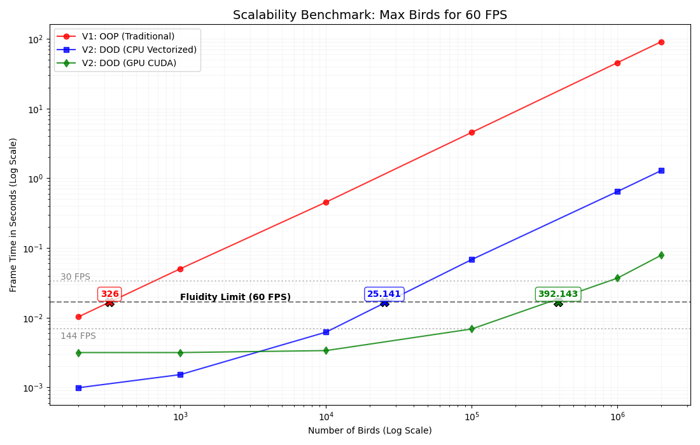

# 🐦 Birdy AI: Evolución del Cerebro Neuroevolutivo
Este documento detalla la progresión de la arquitectura de la red neuronal aplicada a nuestro proyecto Birdy, un sistema de aprendizaje por refuerzo donde una población de pájaros evoluciona para dominar un entorno dinámico.

## LOG DE EVOLUCIÓN: BIRDY NEURAL NETWORK

| FASE | ARQUITECTURA | PESOS | DESCRIPCIÓN TÉCNICA |
| :--- | :--- | :--- | :--- |
| **01. Prototipo** | **3 - 5 - 1** | ~20 | **Reflejo Básico:** Solo esquiva tuberías. Entradas: Distancia X, Distancia Y, y Velocidad. |
| **02. Expansión** | **11 - 16 - 1** | ~192 | **Percepción Total:** Añadimos Espadas, Monedas y PowerUps con sensores individuales para cada uno. |
| **03. Actual (Deep)**| **9 - 10 - 6 - 1**| 156 | **Estratega:** Dos capas ocultas. Capacidad de priorizar: "Esquivar espada > Recoger moneda". |

---

### Cambios Clave en la Lógica de Entrenamiento

* **De Destrucción a Persistencia:** Los objetos ya no mueren al ser tocados (`dokill=False`). Usamos `hit_items` por pájaro para que la horda compita en igualdad de condiciones.
* **Normalización $[0, 1]$:** Todos los inputs (distancias y velocidades) se escalan según el tamaño de la pantalla para estabilizar los gradientes de la red.
* **Jerarquía de Fitness:**
    * **Vivir:** +1 (Supervivencia)
    * **Moneda:** +100 (Incentivo)
    * **PowerUp:** +500 (Prioridad)
    * **Espada:** -300 (Castigo por daño) 
    > **Nota:** Castigos bajos provocan saltos constantes en el pájaro ya que esta es la mejor estrategia si solo nos importa sobrevivir.

---

### Configuración de Capas Actual (9-10-6-1)
1. **Input (9):** [PipeX, PipeY, CoinX, CoinY, PwX, PwY, SwX, SwY, SpeedY]
2. **Hidden 1 (10):** Extracción de patrones de proximidad.
3. **Hidden 2 (6):** Toma de decisiones lógica y estratégica.
4. **Output (1):** Decisión binaria de salto (Función Sigmoide > 0.5).

---

### Arquitectura de Alto Rendimiento

* **Motor Dual CPU/GPU (Motor Agnóstico):** El sistema detecta automáticamente si hay una GPU compatible. 
    * Usa **CuPy** (CUDA) para poblaciones masivas (>10.000).
    * Usa **NumPy** para pruebas ligeras en CPU.
* **Vectorización de Ciclo Completo:** Hemos eliminado los bucles `for` en la lógica de los pájaros. El cerebro (IA), la física y las colisiones se calculan como operaciones de matrices de una sola instrucción, independientes a los sprites.
* **Compactación Dinámica (Slicing):** A medida que los pájaros mueren, el motor "recorta" las matrices de cálculo. Si quedan 800 vivos de 1.000.000, la GPU solo procesa esos 800, acelerando los FPS exponencialmente al final de cada generación.

### Optimizaciones de Memoria

* **Descarga Selectiva (Zero-Bottleneck):** Solo se transfieren de la VRAM (GPU) a la RAM (CPU) los datos de los 10 mejores pájaros y el líder para su renderizado en Pygame. El resto de la población permanece en la GPU, eliminando cuellos de botella.
* **Detección de Colisiones AABB Vectorizada:** Las colisiones con ítems y tuberías se calculan comparando el array de posiciones `Y` completo contra las coordenadas de los obstáculos, detectando miles de choques en microsegundos.
* **Persistencia Híbrida:** Los pesos se guardan en formato `.npz` estándar de NumPy. Al cargar, el sistema los "sube" a la GPU automáticamente mediante `xp.asarray()`, permitiendo entrenar en un PC potente y ejecutar el modelo en cualquier otro.

---

## Benchmark: El Salto a la Computación Masiva

Tras someter a prueba las tres iteraciones del motor, los resultados demuestran que la optimización ha transformado el sistema de una simulación limitada a un motor de vida artificial a escala masiva.

### Comparativa de Escalabilidad Real

| Arquitectura | Límite 60 FPS | Tiempo (1M pájaros) | Mejora vs V1 | Complejidad |
| :--- | :--- | :--- | :--- | :--- |
| **V1: OOP (Python)** | **~326 pájaros** | ~45,50 s (Teórico) | **Base** | $O(n)$ Lineal Ineficiente |
| **V2: DOD (CPU)** | **~25.141 pájaros** | ~0,68 s | **x66** faster | $O(n)$ SIMD Vectorizado |
| **V2: DOD (GPU)** | **~392.143 pájaros** | **~0,07 s** | **x650** faster | **Sub-lineal / Paralelo** |

1.  **Paradigma DOD (Data-Oriented Design):** Eliminamos la gestión de "objetos" individuales para procesar **arrays contiguos**. Esto maximiza la **Cache Locality** y permite el uso de instrucciones **SIMD**, logrando que la versión CPU sea **66x más rápida** que la original.
2.  **Paralelismo CUDA:** La GPU lanza miles de hilos simultáneos, permitiendo que el coste de procesar 10.000 pájaros sea casi idéntico al de 200. El límite actual es la **VRAM** (para una **RTX3060 laptop**: *OutOfMemory a los 30M de individuos*), no la velocidad de cálculo.

> **Conclusión:** La arquitectura actual permite simular en segundos lo que antes requeriría horas de procesamiento.

## RETOS TÉCNICOS Y "GOTCHAS" DE LA OPTIMIZACIÓN

### 1. Diferenciación: Computación Masiva vs. Dibujo Selectivo

Uno de los mayores desafíos fue entender que la escala de la simulación no puede ser la misma que la de la visualización.

* **Computación "Ciega" (GPU):** La simulación física, las colisiones y las decisiones de la IA ocurren para el **1.000.000 de pájaros** simultáneamente en la VRAM. A la GPU no le importa "ver" los pájaros; solo procesa vectores numéricos de forma invisible y masiva.
* **Dibujo "Selectivo" (CPU/Pygame):** Dibujar un millón de sprites colapsaría el bus PCIe y saturaría la pantalla. 
    * **La Estrategia:** Solo "bajamos" de la GPU a la CPU (vía `.asnumpy()`) los datos de una **muestra representativa** (el Top 10 y el líder).
    * **Resultado:** Mientras la tarjeta gráfica calcula el destino de un millón de individuos, el procesador solo se encarga de pintar 11 sprites, manteniendo los FPS estables.

### 2. Cambio de Paradigma: De Orientación a Objetos (OOP) a Orientación a Datos (DOD)

* **El Problema de la OOP (Object-Oriented):** Originalmente, cada pájaro era una instancia de la clase Birdy. Esto significaba tener 1.000.000 de objetos dispersos en la memoria. Para la CPU, saltar de un objeto a otro para leer su self.y es extremadamente lento debido a los "Cache Misses" (el procesador pierde tiempo buscando datos lejanos).

* **La Solución DOD (Data-Oriented):** Hemos destruido la idea del pájaro como "objeto individual". Ahora, la población son Arrays Contiguos de datos puros (bird_y, bird_speed, bird_alive).
    * Los datos están empaquetados linealmente en la memoria (VRAM).

    * El hardware puede leer miles de posiciones de una sola vez porque están una al lado de la otra.

Resultado: Ya no le decimos a cada pájaro "actualiza tu física", le decimos al procesador "suma la gravedad a todo este bloque de un millón de números".

### 3. salto a la computación masiva en GPU 

#### 3.1. El Desafío del Mapeo de Índices (Compactación)
* **Problema:** Al optimizar el rendimiento filtrando solo los pájaros vivos (`idx_alive`), perdimos la relación directa con los índices originales de la población. Esto provocó errores de `IndexError` al intentar acceder a la matriz de decisiones (pequeña) usando índices globales (grandes).
* **Solución:** Implementamos un sistema de "Mapeo Relativo". El líder siempre se identifica primero de forma global, pero sus inputs se extraen usando su posición relativa dentro del buffer de supervivientes.

#### 3.2. El Desafío del Mapeo de Índices y Compactación
* **Problema:** Al trabajar con orientación a datos y filtrar solo los vivos (idx_alive), perdimos la relación directa con la identidad original de cada agente. Los índices globales (del 0 al 1.000.000) ya no servían para indexar las nuevas matrices compactas de supervivientes, causando errores de IndexError.

* **Solución:** Implementamos un sistema de Mapeo Relativo. 
    * Los cálculos masivos se hacen en "espacio compacto" (solo vivos).
    * La identidad del líder se mantiene globalmente, pero para extraer su red neuronal o su visión, calculamos su posición relativa dentro del bloque de supervivientes. Es una transición constante entre la visión global (población) y la visión local (datos procesados).

